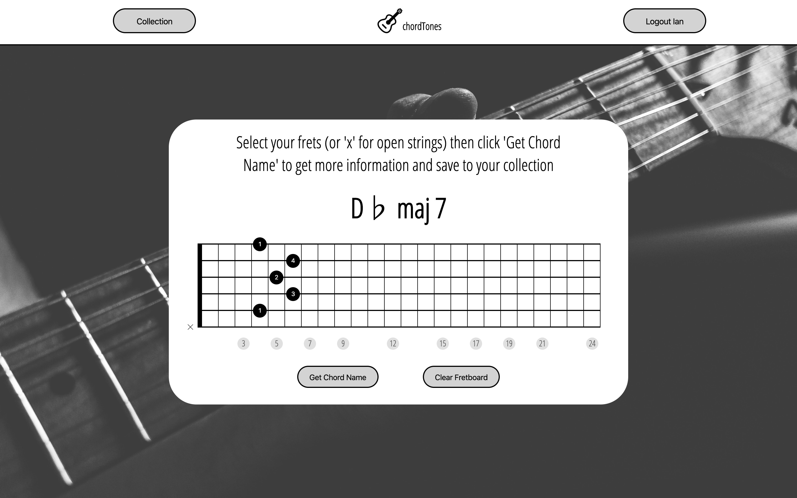

Chordtones
----------

React frontend for Chordtones App

Users can find out chord names and finger positions for guitar chords and add them to a collection for future reference.

Click [here](https://chordtones.herokuapp.com/) to try it out.

Screenshot:

